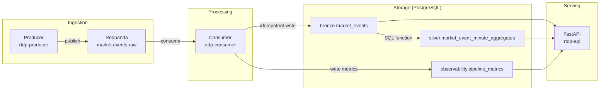

# Real-Time Data Platform

A local-first, event-driven data platform built with Python, Redpanda (Kafka-compatible), PostgreSQL, and FastAPI. Designed to demonstrate modern Data Engineering practices: versioned event contracts, medallion data layers, idempotent persistence, operational observability, and a documented GCP target architecture.

---

## What This Project Demonstrates

- End-to-end streaming pipeline: producer → broker → consumer → storage → API
- Versioned, validated event contracts using Pydantic
- Medallion architecture (bronze / silver / gold / observability / ai schemas)
- Idempotent event persistence with `ON CONFLICT DO NOTHING`
- Prometheus-compatible metrics endpoint for operational observability
- Containerised full-stack runtime with Docker Compose
- CI pipeline with linting, tests, and import smoke tests via GitHub Actions
- GCP target architecture mapping (Pub/Sub, Cloud Run, Cloud SQL, BigQuery, Dataflow)

---

## Architecture



---

## Implemented Features

### Streaming pipeline

- Python producer publishes `MarketEvent` records to `market.events.raw`
- Python consumer reads, validates (Pydantic), and persists events to PostgreSQL
- Shared versioned `MarketEvent` contract in `packages/contracts`
- Idempotent writes using `ON CONFLICT(event_id) DO NOTHING`

### Storage

- PostgreSQL with medallion schemas: `bronze`, `silver`, `gold`, `observability`, `ai`
- `bronze.market_events` — raw validated events
- `silver.market_event_minute_aggregates` — per-symbol, per-minute rollups
- `observability.pipeline_metrics` — consumer metric time-series
- `ai.market_event_embeddings` — pgvector-enabled table for future embedding workloads

### Serving

- FastAPI application with health, readiness, version, events, metrics, aggregates, and Prometheus endpoints

### Observability

- Consumer writes structured metrics to `observability.pipeline_metrics`
- `/metrics-prometheus` exposes a Prometheus-format gauge endpoint
- Structured JSON logs with graceful shutdown for producer and consumer

### Infrastructure

- Full Docker Compose stack: `redpanda`, `postgres`, `api`, `producer`, `consumer`
- GitHub Actions CI: install, lint, test, import smoke test

---

## Tech Stack

| Layer | Technology |
|---|---|
| Event broker | Redpanda (Kafka-compatible) |
| Stream producer | Python, `kafka-python` |
| Stream consumer | Python, `kafka-python` |
| Event contract | Pydantic v2, shared `rtdp-contracts` package |
| Storage | PostgreSQL 16, pgvector |
| ORM / driver | psycopg v3 |
| Serving | FastAPI, Uvicorn |
| Package manager | uv (workspace mode) |
| Linter | Ruff |
| Tests | pytest |
| Container runtime | Docker Compose |
| CI | GitHub Actions |
| Target cloud | GCP (Pub/Sub, Cloud Run, Cloud SQL, BigQuery, Dataflow) |

---

## Data Flow

```
Producer
  → publishes MarketEvent (JSON, schema_version=1.0) to Redpanda topic: market.events.raw

Consumer
  → polls market.events.raw
  → validates each message via Pydantic MarketEvent model
  → writes to bronze.market_events (idempotent, event_id as PK)
  → writes pipeline metrics to observability.pipeline_metrics

silver.refresh_market_event_minute_aggregates()
  → aggregates bronze.market_events by symbol and minute window
  → upserts into silver.market_event_minute_aggregates

FastAPI
  → /events          → queries bronze.market_events
  → /aggregates/minute → queries silver.market_event_minute_aggregates
  → /metrics         → queries observability.pipeline_metrics
  → /metrics-prometheus → formats latest metrics as Prometheus gauge text
```

---

## Local Quickstart

**Prerequisites:** Docker and Docker Compose.

```bash
git clone <repo-url>
cd real-time-data-platform
docker compose up --build -d
```

This starts:
- `rtdp-redpanda` on ports `9092` (internal) and `19092` (external)
- `rtdp-postgres` on port `15432`
- `rtdp-producer` — publishes events continuously
- `rtdp-consumer` — consumes and persists events
- `rtdp-api` on port `8000`

Once running:

```bash
# Health check
curl http://localhost:8000/health

# Recent events (bronze layer)
curl http://localhost:8000/events

# Minute aggregates (silver layer)
curl http://localhost:8000/aggregates/minute

# Pipeline metrics
curl http://localhost:8000/metrics

# Prometheus-format metrics
curl http://localhost:8000/metrics-prometheus
```

**Running minute aggregates refresh manually (psql):**

```bash
docker exec -it rtdp-postgres psql -U rtdp -d realtime_platform \
  -c "SELECT silver.refresh_market_event_minute_aggregates();"
```

---

## API Endpoints

| Method | Path | Description |
|---|---|---|
| GET | `/health` | Liveness check |
| GET | `/readiness` | Readiness check (database connectivity verified) |
| GET | `/version` | Service name, version, environment |
| GET | `/events` | Recent events from `bronze.market_events` (default: 20, max: 100) |
| GET | `/metrics` | Pipeline metric time-series (default: 50, max: 200) |
| GET | `/metrics-prometheus` | Latest metrics as Prometheus gauge text (MIME: `text/plain`) |
| GET | `/aggregates/minute` | Per-symbol per-minute rollups from `silver` (default: 20, max: 200) |

---

## Observability and Metrics

The consumer emits structured metrics to `observability.pipeline_metrics` after each processing cycle.

**Tracked metrics:**

| Metric | Description |
|---|---|
| `events_processed_total` | Cumulative count of events written to bronze |
| `latest_processed_offset` | Most recent Kafka offset consumed |
| `processing_lag_seconds` | Time delta between event timestamp and ingestion |
| `consumer_errors_total` | Count of validation or persistence errors |

The `/metrics-prometheus` endpoint exposes these as a Prometheus gauge family (`rtdp_pipeline_metric_value`) with a `metric_name` label, compatible with Prometheus scrape and Managed Prometheus on GCP.

Logs are emitted as structured JSON to stdout for both producer and consumer, with graceful shutdown handling in the application runtime.

---

## Data Contracts

The `MarketEvent` schema is defined once in `packages/contracts` and imported by both the producer and consumer.

```python
class MarketEvent(BaseModel):
    schema_version: Literal["1.0"] = "1.0"
    event_id: str
    symbol: str
    event_type: Literal["trade"]
    price: Decimal       # > 0
    quantity: Decimal    # > 0
    event_timestamp: datetime
```

**Design properties:**
- `schema_version` field enables forward-compatible evolution
- `event_id` is the idempotency key — duplicate messages are safely discarded
- Pydantic validation is enforced at consumer ingestion time before any write
- Contract is versioned as a separate workspace package (`rtdp-contracts`) for independent update and testing

---

## Medallion Data Layers

| Schema | Role | Status |
|---|---|---|
| `bronze` | Raw validated events — append-only, full fidelity | Implemented |
| `silver` | Cleaned, aggregated — minute-level rollups by symbol | Implemented |
| `gold` | Business-level aggregates (e.g. daily, weekly summaries) | Planned |
| `observability` | Pipeline health metrics time-series | Implemented |
| `ai` | Embedding storage for vector search (pgvector) | Schema created |

The `silver` layer is populated by calling `silver.refresh_market_event_minute_aggregates()`, a PostgreSQL function that upserts from `bronze.market_events`.

---

## GCP Target Architecture

> **Status:** The FastAPI serving layer is deployed to Google Cloud Run and connected to Cloud SQL PostgreSQL through Secret Manager. A Pub/Sub publisher MVP is implemented locally (`apps/pubsub-publisher`) and validates MarketEvent payloads before publishing. A Pub/Sub worker MVP is implemented locally (`apps/pubsub-worker`): it decodes message bytes, validates against `MarketEvent`, and inserts into `bronze.market_events` with `ON CONFLICT DO NOTHING` idempotency — fully tested with mocked DB. Cloud deployment of the worker (Cloud Run job or push subscription) is not yet executed; real end-to-end GCP validation requires Cloud SQL to be started and is planned as the next manual step. BigQuery, Dataflow, and Cloud Monitoring integration remain target architecture items.

| Local Component | GCP Target | Notes |
|---|---|---|
| Redpanda / Kafka | Pub/Sub | Managed event ingestion, fan-out, replay |
| Python producer | Cloud Run job or external source | Stateless event publishing |
| Python consumer | Cloud Run worker or Dataflow | Consumer or streaming enrichment pipeline |
| PostgreSQL container | Cloud SQL for PostgreSQL | Implemented as managed operational store |
| FastAPI container | Cloud Run service | Already containerised, Cloud Run-compatible |
| `/metrics-prometheus` | Cloud Monitoring / Managed Prometheus | Metric scrape target |
| `silver` / analytical layer | BigQuery | Long-horizon analytics over event history |
| Docker Compose | Cloud Run + managed services | Production runtime replacement |
| GitHub Actions | GitHub Actions + GCP deployment pipeline | CI/CD extension |

**Target GCP data flow:**

```
Event source
  → Pub/Sub: market-events-raw
      → Cloud Run worker or Dataflow pipeline
          → Cloud SQL (operational storage)
          → BigQuery (analytical reporting)
          → Cloud Monitoring (metrics and alerting)
              → Cloud Run API (operational access)
```

See [docs/gcp-architecture.md](docs/gcp-architecture.md) for the full GCP architecture document.

**Current GCP MVP:**

```text
https://rtdp-api-892892382088.europe-west1.run.app
```

Validated public endpoints:

```bash
curl https://rtdp-api-892892382088.europe-west1.run.app/health
curl https://rtdp-api-892892382088.europe-west1.run.app/version
curl https://rtdp-api-892892382088.europe-west1.run.app/readiness
curl 'https://rtdp-api-892892382088.europe-west1.run.app/events?limit=3'
```

Cloud SQL status:

```text
Instance: rtdp-postgres
Database: realtime_platform
PostgreSQL: 16
Region: europe-west1
Secret Manager: rtdp-database-url
```

The database is currently schema-ready but empty until cloud-side ingestion is added.

---

## Validation and CI

GitHub Actions runs on every push to `main` and on pull requests:

```
uv sync --all-packages     # Install full workspace
ruff check .               # Lint
pytest -q                  # Run test suite
python -c "import rtdp_api, rtdp_consumer, rtdp_producer, rtdp_pubsub_publisher"  # Import smoke test
```

**Test coverage areas:**
- `MarketEvent` contract validation (field types, constraints, schema version)
- API operational endpoints (`/health`, `/readiness`, `/version`)
- API data endpoints (`/events`, `/aggregates/minute`)
- Prometheus metrics endpoint format

**Running locally:**

```bash
uv sync --all-packages
uv run ruff check .
uv run pytest -q
```

---

## Recruiter-Facing Evidence

This project demonstrates practical Data Engineering skills relevant to streaming platform and cloud data roles in 2026/2027:

| Skill Area | Evidence |
|---|---|
| Streaming ingestion | Kafka-compatible producer/consumer with offset tracking |
| Event schema design | Versioned Pydantic contract with idempotency key |
| Medallion architecture | bronze / silver / gold / observability / ai schemas in PostgreSQL |
| Idempotent processing | `ON CONFLICT(event_id) DO NOTHING` enforced at persistence layer |
| Operational observability | Prometheus-format metrics endpoint, structured JSON logs |
| Cloud architecture thinking | Documented GCP mapping: Pub/Sub, Cloud Run, BigQuery, Dataflow |
| API design | FastAPI with health, readiness, version, data, and metrics endpoints |
| Containerised runtime | Docker Compose stack for full local development |
| CI discipline | Lint + test + smoke test on every push, no manual steps |
| Monorepo workspace | uv workspace with shared contracts package across apps |

---

## Current Status and Next Steps

**Implemented (local):**
- Python producer, Redpanda broker, Python consumer
- Versioned MarketEvent contract with Pydantic validation
- Idempotent bronze persistence and minute-level silver aggregates
- FastAPI serving layer with Prometheus metrics endpoint
- Docker Compose full-stack runtime
- GitHub Actions CI

**Implemented (GCP MVP):**
- FastAPI deployed to Cloud Run, connected to Cloud SQL via Secret Manager
- Pub/Sub publisher (`apps/pubsub-publisher`): validates and publishes MarketEvent JSON to `market-events-raw` topic
- Pub/Sub worker (`apps/pubsub-worker`): decodes message bytes, validates `MarketEvent`, inserts into `bronze.market_events` (idempotent); fully tested locally with mocked DB — cloud deployment not yet executed

**Planned (next phases):**
- Deploy Pub/Sub worker to Cloud Run (push subscription or pull job); requires Cloud SQL to be started
- Populate `gold` schema with business-level daily/weekly aggregates
- Populate `ai.market_event_embeddings` with pgvector embeddings
- Automate `silver.refresh_market_event_minute_aggregates()` execution so the silver layer refreshes continuously
- dbt models for `silver` and `gold` layers
- Managed Prometheus scrape and Cloud Monitoring dashboard
